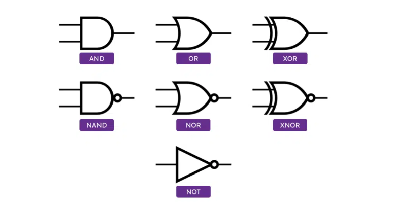
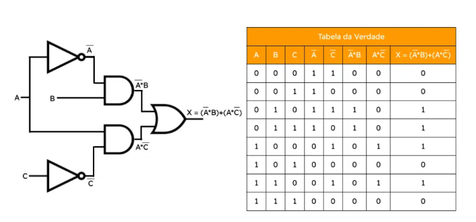

# Sistemas inteligentes

## Redes neurais

Uma rede neural artificial é composta por várias unidades de processamento, cujo funcionamento é bastante simples. Essas unidades, geralmente são conectadas por canais de comunicação que estão associados a determinado peso. As unidades fazem operações apenas sobre seus dados locais, que são entradas recebidas pelas suas conexões. O comportamento inteligente de uma Rede Neural Artificial vem das interações entre as unidades de processamento da rede.

A operação de uma unidade de processamento, proposta por McCullock e Pitts em 1943, pode ser resumida da seguinte maneira:

- Sinais são apresentados à entrada;
- Cada sinal é multiplicado por um número, ou peso, que indica a sua influência na saída da unidade;
- É feita a soma ponderada dos sinais que produz um nível de atividade;
 - Se este nível de atividade exceder um certo limite (threshold) a unidade produz uma determinada resposta de saída.

Suponha que tenhamos p sinais de entrada $X_1, X_2, ..., X_p$ e pesos $w_1, w_2, ..., w_p$ e limitador t; com sinais assumindo valores booleanos (0 ou 1) e pesos valores reais.

Neste modelo, o nível de atividade a é dado por:
$$a = w_1X_1 + w_2X_2 + ... + w_pX_p$$
A saída y é dada por  
$
y = 1,
$ se a $\geq$ t ou
$y = 0$, se a $\lt$ t.

A maioria dos modelos de redes neurais possui alguma regra de treinamento, onde os pesos de suas conexões são ajustados de acordo com os padrões apresentados. Em outras palavras, elas aprendem através de exemplos.

Arquiteturas neurais são tipicamente organizadas em camadas, com unidades que podem estar conectadas às unidades da camada posterior.

Usualmente as camadas são classificadas em três grupos:
Camada de Entrada: onde os padrões são apresentados à rede;
Camadas Intermediárias ou Escondidas: onde é feita a maior parte do processamento, através das conexões ponderadas; podem ser consideradas como extratoras de características;
Camada de Saída: onde o resultado final é concluído e apresentado.
Uma rede neural é especificada, principalmente pela sua topologia, pelas características dos nós e pelas regras de treinamento. A seguir, serão analisados os processos de aprendizado.

### Portas Lógicas

- **Porta AND**: Retorna 1 apenas quando todas as suas entradas são 1.
- **Porta OR**: Retorna 1 quando pelo menos uma das suas entradas é 1.
- **Porta NOT**: Inverte o valor da entrada; retorna 0 para entrada 1 e 1 para entrada 0.
- **Porta NAND**: Retorna 0 apenas quando todas as suas entradas são 1. É a negação da porta AND.
- **Porta NOR**: Retorna 1 apenas quando todas as suas entradas são 0. É a negação da porta OR.
- **Porta XOR**: Retorna 1 quando um número ímpar de entradas é 1.
- **Porta XNOR**: Retorna 1 quando um número par de entradas é 1. É a negação da porta XOR.

#### Tabela verdade

## Busca contra adversário
A idéia de que o sistema as condições do meio em que o agente esteja inserido , para teste dos parametro do controlador
